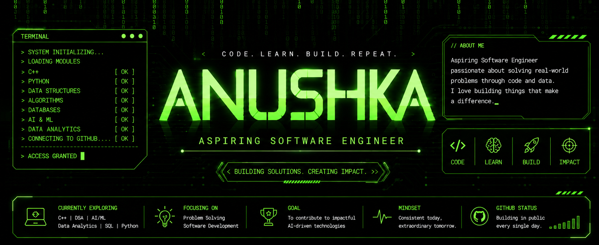

  

  

## 🚀 About Me

I'm an aspiring Software Engineer with a strong interest in Artificial Intelligence, programming, and problem-solving.
Currently, I am strengthening my foundations in:

- C++ Programming
- Data Structures & Algorithms
- C Programming
- Software Development
- Artificial Intelligence & Machine Learning
- Python Development

Alongside software development, I also have experience in Data Analytics, SQL, R, and dashboard creation.

## 🎓 Certifications
- Google Data Analytics Professional Certificate

## Languages and tools
<h2 align="center">⚙️ Tech Stack</h2>

<!-- C / C++ / Python -->

<!-- SQL / R -->

<!-- Power BI / Tableau / Excel -->

<!-- IDEs -->

<!-- Cloud / Data -->

### Areas of Interest
- Software Engineering
- Artificial Intelligence
- Machine Learning
- Data Structures & Algorithms
- Full Stack Development

## 🌱 Currently Learning

- C++ Programming
- C Programming
- Data Structures & Algorithms (DSA)
- Problem Solving
- Git & GitHub
- Fundamentals of Artificial Intelligence and Machine Learning

I enjoy building projects and continuously improving my programming and analytical skills through hands-on learning.

## 🎯 Career Goal
To become a skilled Software Engineer and contribute to impactful AI-driven technologies while continuously improving my problem-solving and development skills.

<h2 align="center">📬 Connect With Me</h2>

